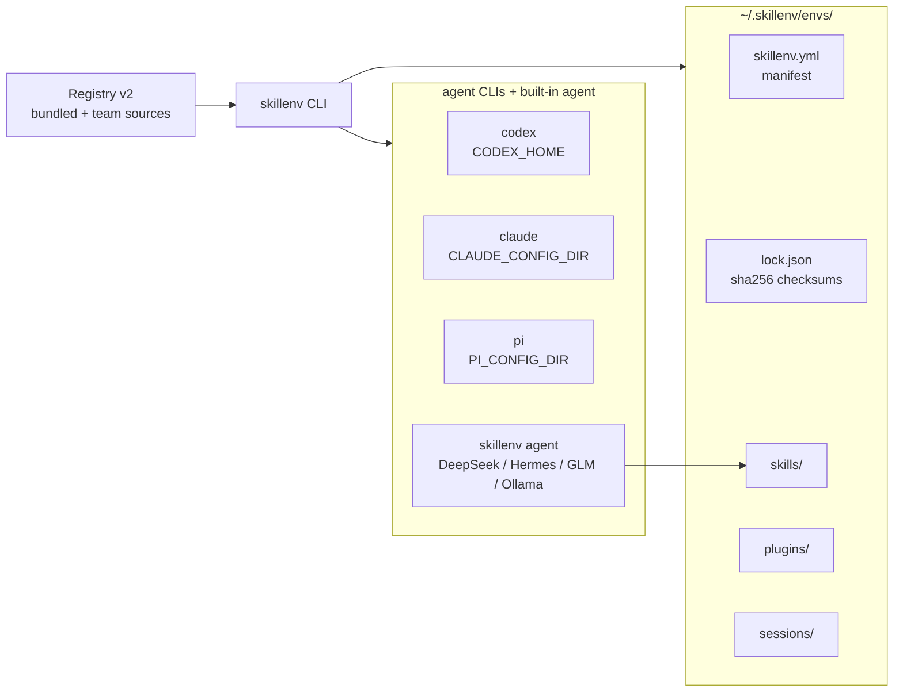

<div align="center">

# 🧰 skillenv

**A Conda-like environment manager for AI agent skills.**

Give every task its own isolated agent home: skills, plugins, sessions, and
configuration — for **Codex**, **Claude Code**, **pi**, and any agent CLI.

Install (once published to npm — requires the `NPM_TOKEN` release secret,
see [docs/publishing.md](docs/publishing.md)):

```bash
npm install -g @kobelyww/skillenv
```

Or straight from a clone:

```bash
git clone https://github.com/Kobelyww/skillenv.git && cd skillenv
npm install && npm run build && npm install -g .
```

[](../../actions)


</div>

---

## Architecture



## Why

Agent skill directories grow into a swamp: research skills mixed with coding
skills, plugin configs clobbering each other, experiments leaking into your
daily setup, and no record of what was installed from where.

`skillenv` solves it the way Conda solved Python environments:

```bash
skillenv create research --preset research        # isolated env in one command
skillenv install research pdf@^1.0                # versioned installs with dependencies
skillenv run research                             # launch the agent inside the env
skillenv export research > skillenv.yml           # reproducible manifests
skillenv create -f skillenv.yml                   # recreate anywhere
```

Each environment lives under `~/.skillenv/envs/<name>` and is a **complete,
self-contained agent home**:

```text
~/.skillenv/envs/research/
  config.toml        # adapter config (e.g. Codex plugins)
  skillenv.yml       # manifest: adapter, skills, plugins
  lock.json          # exact installs: source, version, checksum (sha256)
  skills/            # installed skills (SKILL.md directories)
  plugins/           # adapter plugin space
  sessions/          # built-in agent session transcripts
  log/               # per-env logs
```

## Highlights

| Capability | What you get |
|---|---|
| **Adapter system** | First-class isolation per agent CLI: `codex` → `CODEX_HOME`, `claude` → `CLAUDE_CONFIG_DIR`, `pi` → `PI_CONFIG_DIR`, plus `gemini` (experimental) and `generic` (any command via `SKILLENV_*` vars) |
| **Versioned installs** | Skills install from a name + semver range (`pdf@^1.0`), a GitHub subtree (`github:owner/repo/path@ref`), or a local directory — recorded in `lock.json` with sha256 checksums |
| **Dependency resolution** | Skills can declare dependencies; skillenv intersects semver constraints across the graph, detects conflicts with full requirer chains, and installs topologically |
| **Registry v2** | Bundled registry + your own file/HTTP registry sources with caching, search, and a `registry publish` validation flow |
| **Built-in coding agent** | `skillenv agent` — a streaming tool-calling agent over any OpenAI-compatible provider (DeepSeek, Nous Hermes, GLM, OpenAI, Ollama, ModelArts MaaS) with 10 workspace tools and skill injection |
| **Persistent memory** | `memory_read`/`memory_write` tools keep durable facts, decisions, and preferences per environment — the working agent starts every session with its accumulated context |
| **Reproducibility** | `export` emits a manifest from the lock; `create -f` recreates the environment elsewhere; `doctor` verifies layout and checksums |

## Quick start

```bash
npm install -g @kobelyww/skillenv

# 1. Create an environment from a preset
skillenv create research --preset research

# 2. Install skills (registry name, GitHub subtree, or local dir)
skillenv install research github:openai/skills/skills/.curated/pdf
skillenv install research ./my-skills/custom-search

# 3. Inspect
skillenv env list
skillenv env info research
skillenv doctor research

# 4. Run an agent inside the environment
skillenv run research -- codex          # CODEX_HOME=~/.skillenv/envs/research
skillenv run research -- claude         # CLAUDE_CONFIG_DIR=...
skillenv run research -- pi             # PI_CONFIG_DIR=...

# 5. Reproduce elsewhere
skillenv export research > skillenv.yml
```

Zero-config rule: `skillenv` never needs an API key — only the built-in agent
talks to providers, and only when you ask it to.

## The built-in agent

`skillenv agent` turns any environment into a working coding agent. It speaks
the OpenAI-compatible chat protocol, so every major provider works:

```bash
export DEEPSEEK_API_KEY=sk-...
skillenv agent research -p deepseek -m deepseek-chat --dir ~/my-project

export ANTHROPIC_API_KEY=sk-ant-...      # Claude (native Messages protocol)
skillenv agent research -p anthropic -m claude-sonnet-4-5 --dir ~/paper

export NOUS_API_KEY=...                 # Nous Hermes
skillenv agent research -p nous --dir ~/paper

export GLM_API_KEY=...                  # Zhipu GLM
skillenv agent research -p glm -m glm-4.6

# Fully local with Ollama — no key at all
skillenv agent research -p ollama -m qwen3:8b
```

What the agent can do:

- **Tools**: `read_file`, `write_file`, `edit_file` (unique-match enforced),
  `list_dir`, `glob`, `grep`, `run_command` (timeout-guarded shell),
  `web_fetch` (SSRF-guarded: private addresses blocked), `skill_list`,
  `skill_read`
- **Skills**: the environment's skills are injected as a catalog; the agent
  loads a skill's full `SKILL.md` with `skill_read` before following it — or
  inline specific skills with `--skills pdf,latex`
- **Sessions**: every turn persists to `sessions/`; resume with
  `--session <id>` or `--continue`, inspect with `skillenv session list|show`
- **Streaming**: SSE token streaming with compact tool-card rendering
  (`-q` for text-only)

Interactive REPL: run `skillenv agent <env>` without a prompt. Slash commands:
`/exit`, `/sessions`, `/skills`.

One-shot and scriptable:

```bash
echo "explain this repo's build system" | skillenv agent research --dir .
skillenv agent research -q "why does make test fail?" --max-iterations 10
```

## Dependency resolution

Skills declare dependencies in `SKILL.md` frontmatter:

```markdown
---
name: latex-paper
description: Write LaTeX papers with citations.
version: 1.2.0
dependencies:
  - pdf@^1.0
  - zotero@>=2
---
```

`skillenv install env latex-paper` resolves the full closure: it picks the
highest registry version satisfying every constraint, merges constraints from
multiple requirers, reports conflicts with the full chain
(`a requires ^1.0; b requires ^2.0; available: 1.0.0, 2.0.0`), tolerates
cycles, and installs dependencies before dependents.

## Registries

The bundled registry ships versioned entries. Add your own sources — a file
path or an HTTPS URL — and refresh the cache:

```bash
skillenv registry add team https://skills.example.com/team.json
skillenv registry update
skillenv registry search latex
skillenv registry show pdf
```

Publish a skill to a registry with validation (frontmatter completeness,
semver version):

```bash
skillenv registry publish ./my-skill \
  --source github:me/skills/skills/my-skill@v1.0.0 \
  --registry ./team.json
```

## Adapters

| Adapter | Isolation variable | Notes |
|---|---|---|
| `codex` | `CODEX_HOME` | Fully supported; plugin selectors recorded in `config.toml` |
| `claude` | `CLAUDE_CONFIG_DIR` | Fully supported; `skills/` doubles as user-level skills |
| `pi` | `PI_CONFIG_DIR` | Best effort |
| `gemini` | — (experimental) | gemini-cli has no config-dir override yet; `SKILLENV_*` vars only |
| `generic` | — | Any command: `SKILLENV_ENV`, `SKILLENV_ENV_ROOT`, `SKILLENV_SKILLS_DIR` |

```bash
skillenv create claude-env --adapter claude
skillenv run claude-env                     # defaults to the adapter's command
```

## Commands

```text
skillenv create [name] [-f manifest] [-p preset] [-a adapter] [--install-plugins]
skillenv clone <src> <target>
skillenv install <env> <specs...> [--force] [--skip-existing]
skillenv remove <env>
skillenv export <env>
skillenv doctor <env>
skillenv diff <a> <b>
skillenv run <env> [-- command...]
skillenv agent <env> [prompt] [-p provider] [-m model] [--fallback-provider id] [--tools names]
                            [--confirm-shell] [-s session] [-c] [-q] [--dir path] [--skills names]
skillenv agent-eval <suite.yaml> <env> [--report report.json] [--keep-workdirs]
skillenv env list | env info <env> | env rename <old> <new>
skillenv preset list
skillenv registry list | show | search | add | sources | update | publish
skillenv adapter list | codex | claude-code | pi | gemini
skillenv plugin install | plugin list
skillenv session list | show | export <env> <id> [-o file]
```

## Library usage

```ts
import {
  createEnv, installSpecs, exportManifest, checkEnv,
  resolveProvider, runAgentTurn,
} from "@kobelyww/skillenv";

const env = createEnv("triage", process.env.HOME + "/.skillenv");
await installSpecs(env.root, process.env.HOME + "/.skillenv", ["pdf@^1"]);
```

## Verified against the real world

All of the following were executed for real during development of this
version (not simulated):

- **Codex CLI 0.153.4** launched via `skillenv run` with `CODEX_HOME`
  isolation; **Claude Code 2.1.139** with `CLAUDE_CONFIG_DIR` isolation.
- **DeepSeek live sessions** (`deepseek-chat`): a full coding arc — implement
  a CLI + unittest suite, multi-turn continuation, agent self-repair after a
  failing import — with results verified independently; provider failover
  from a dead endpoint to live DeepSeek; skill consumption via
  `skill_list`/`skill_read` against a real installed skill.
- **Real GitHub installs** from this repository and from
  `openai/skills` (zipball download → subtree copy → checksum lock).
- **Agent evaluation suites run live** (`agent-eval`, DeepSeek): 2/2 cases
  passed with tool-sequence and file assertions, plus content assertions
  (`agent-contains`) verified against live answers.
- **Self-hosting**: `env rename` and the eval `agent-contains` expectation
  were implemented by skillenv's own agent on a copy of this repository, then
  reviewed, tested, and adopted (see git history).
- **Cross-platform CI**: Node 20/22 × ubuntu/macos/**windows**, all green —
  the Windows leg caught and fixed real path-separator and `.cmd` shim bugs.

## Documentation

- [Quickstart](docs/quickstart.md) — first environment in five minutes
- [Agent guide](docs/agent.md) — providers, tools, sessions, skill injection
- [Adapters](docs/adapters.md) — per-CLI isolation details and caveats
- [Manifest spec](docs/manifest-spec.md) — `skillenv.yml` format
- [Lockfile spec](docs/lockfile-spec.md) — `lock.json` format and checksums
- [Publishing](docs/publishing.md) — release and registry workflow
- [Development log](docs/development-log.md) — how the v2 rewrite was built and verified

## Development

```bash
npm install
npm run build       # tsup → dist/
npm test            # vitest (148 tests incl. e2e CLI + mock provider)
npm run lint        # eslint
npm run typecheck   # tsc --noEmit
npm run skillenv -- env list   # run the CLI from source
```

## Dogfooding

skillenv develops itself: the `env rename` command was implemented by
`skillenv agent` (deepseek-chat) working in a copy of this repository, then
reviewed, tested, and adopted. See `git log --grep "env rename"`.

The Python 1.x implementation was replaced by this TypeScript rewrite; its
history remains in git (pre-merge `main` history). See also
[SECURITY.md](SECURITY.md) for the agent's tool-safety posture.

## Roadmap

- **MCP integration**: mount external tools via MCP clients; expose the agent itself as an MCP server
- **Subagent delegation**: parallel specialist contexts for large tasks
- **Team backends**: PostgreSQL/Redis session storage for shared deployments
- **Streaming tool arguments**: interleave tool execution with argument streaming

## License

[MIT](LICENSE)
